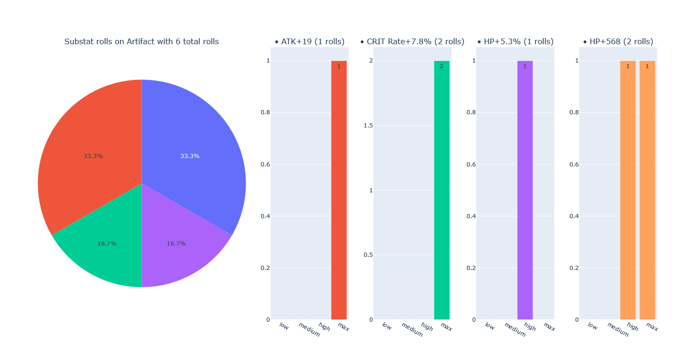

<p align="center">
<a href="" rel="noopener">
</a>
</p>
<h3 align="center">artipy</h3>
<div align="center">


[](https://github.com/trumully/artipy/actions/workflows/main.yml)
[](trumully.github.io/artipy/)
[](LICENSE)
[](https://github.com/astral-sh/ruff)

    
</div>

---

<p align="center"> Easily generate Genshin Impact artifacts.
    <br>
</p>

## 📚 Table of Contents
- [About](#about)
- [Getting Started](#getting_started)
- [Deployment](#deployment)
- [Documentation](https://trumully.github.io/artipy/)
- [Usage](#usage)
- [License](LICENSE)
- [Changelog](CHANGELOG.md)
- [Acknowledgements](#acknowledgements)

## 📝 About <a name = "about" ></a>
This is a Python package that can generate Genshin Impact artifacts as close to how they are in the game as possible. It is intended to be used for statistical analysis 

## 📦 Getting Started <a name = "getting_started" ></a>
To install and use the package right away, you can use `pip`:
```shell
python -m pip install -U git+https://github.com/trumully/artipy.git
# or if you don't have 'git' installed:
python3 -m pip install -U https://github.com/trumully/artipy/zipball/main
```

For development, follow the steps below:

### Prerequisites
To set up a dev environment you'll need `pipx` & `poetry`. Installation instructions for `pipx` on your respective operating system can be found [here](https://pipx.pypa.io/stable/installation/).

Once `pipx` is installed, install `poetry`:
```shell
pipx install poetry
```

### Installing
Clone the repository:
```shell
git clone https://github.com/trumully/artipy.git
```

Activate virtual environment:
```shell
poetry shell
```

Install dependencies:
```shell
poetry install
```

## 🧪 Running tests
Run tests using `pytest`:
```shell
poetry run pytest
```

## 🔧 Usage <a name ="usage" ></a>
For a broader exploration of the usage of the package be sure to checkout the [documentation](https://trumully.github.io/artipy).

<details>
<summary><h3>Create an artifact</h3></summary>

Here we use the [`ArtifactBuilder`](https://trumully.github.io/artipy/artipy.artifacts.html#artipy.artifacts.ArtifactBuilder) class to create an [`Artifact`](https://trumully.github.io/artipy/artipy.artifacts.html#artipy.artifacts.ArtifactBuilder). 
```python
from artipy.artifacts import ArtifactBuilder
from artipy.stats import StatType


def main() -> None:
    artifact = (
        ArtifactBuilder()
        .with_level(8)
        .with_rarity(5)
        .with_mainstat(StatType.ATK_PERCENT, 0.228)
        .with_substats([
            (StatType.ATK, 19),
            (StatType.CRIT_RATE, 0.039),
            (StatType.HP_PERCENT, 0.053),
            (StatType.HP, 568)
        ])
        .with_set("Gladiator's Finale")
        .with_slot("Sands of Eon")
        .build()
    )
    print(artifact)


if __name__ == "__main__":
    main()

```
This results in the following artifact:
```
Sands of Eon [+8]
★★★★★
ATK+22.8%
• ATK+19
• CRIT Rate+3.9%
• HP+5.3%
• HP+568
```
</details>

<details>
<summary><h3>We can do better than this... Let's upgrade!</h3></summary>

We can upgrade the artifact using the aptly named [`upgrade`](https://trumully.github.io/artipy/artipy.artifacts.html#artipy.artifacts.Artifact.upgrade) method on the artifact. Let's upgrade it to +12.
```python
from artipy.artifacts import ArtifactBuilder
from artipy.stats import StatType


def main() -> None:
    artifact = (
        ArtifactBuilder()
        .with_level(8)
        .with_rarity(5)
        # ... other parameters
    )

    for _ in range(4):
        artifact.upgrade()
    print(artifact)


if __name__ == "__main__":
    main()

```
After upgrading this is what we get:
```shell
Sands of Eon [+12]
★★★★★
ATK+30.8%
• ATK+19
• CRIT Rate+7.8%  # <- this was 3.9% before.
• HP+5.3%
• HP+568
```
</details>

<details>
<summary><h3>Let's analyse this artifact a bit.</h3></summary>

Firstly we'll need to import the `artipy.analysis` package to get started.
```python
import artipy.analysis as analysis
from artipy.artifacts import ArtifactBuilder
from artipy.stats import StatType


def main() -> None:
    artifact = (
        ArtifactBuilder()
        .with_level(8)
        .with_rarity(5)
        # ... other parameters
    )

    for _ in range(4):
        artifact.upgrade()
    print(artifact)

    roll_value = analysis.calculate_artifact_roll_value(artifact)
    max_roll_value = calculate_artifact_maximum_roll_value(artifact)
    crit_value = calculate_artifact_crit_value(artifact)
    print(f"Roll Value: {roll_value}")
    print(f"Max Roll Value: {max_roll_value}")
    print(f"Crit Value: {crit_value}")


if __name__ == "__main__":
    main()

```
Here is the output:
```shell
Sands of Eon [+12]
★★★★★
ATK+30.8%
• ATK+19
• CRIT Rate+7.8%
• HP+5.3%
• HP+568
Roll Value: 5.789780576014326490600895658
Max Roll Value: 7.789780576014326490600895658
Crit Value: 15.57999982237815855823370725
```
#### Let's walk through the meaning of these values:
* **Roll Value (RV):** A percentage of the current stat values over their highest potential value. 
* **Max Roll Value (MRV):** The artifact roll value assuming all remaining rolls are of maximum potency.
* **Crit Value (CV):** The value of the artifact's crit stats (CRIT DMG + 2 * CRIT Rate)
</details>

<details>
<summary><h3>Let's plot some data!</h3></summary>

To start plotting let's go ahead and import the `artipy.analysis.plots` sub-package:
```python
import artipy.analysis as analysis
from artipy.analysis import plots
from artipy.artifacts import ArtifactBuilder
from artipy.stats import StatType


def main() -> None:
    artifact = (
        ArtifactBuilder()
        .with_level(8)
        .with_rarity(5)
        .with_mainstat(StatType.ATK_PERCENT, 0.228)
        .with_substats([
        # ... other parameters
    )

    for _ in range(4):
        artifact.upgrade()
    print(artifact)

    roll_value = analysis.calculate_artifact_roll_value(artifact)
    max_roll_value = analysis.calculate_artifact_maximum_roll_value(artifact)
    crit_value = analysis.calculate_artifact_crit_value(artifact)
    print(f"Roll Value: {roll_value}")
    print(f"Max Roll Value: {max_roll_value}")
    print(f"Crit Value: {crit_value}")

    plots.plot_artifact_substat_rolls(artifact)


if __name__ == "__main__":
    main()

```


#### What does this mean?
Each stat on an artifact has a 25% chance of being upgraded every 4 levels. There is then another dice roll that decides how much the stat is increased by (for a 5★ artifact it's in the range of 0.7-1.0 * base value). This plot shows that distribution.

</details>

## 🚀 Deployment <a name ="deployment" ></a>
Build the package using `poetry`:
```shell
poetry build
```
This will create a `tar.gz` and `whl` in the `dist/` directory:
```shell
dist/
├── artipy-(version)-py3-none-any.whl
└── artipy-(version).tar.gz
```

You can install the built package using `pip`:
```shell
python -m pip install -U dist/artipy-(version)-py3-none-any.whl
# or
python -m pip install -U dist/artipy-(version).tar.gz
```

## 🎉 Acknowledgements <a name = "acknowledgements"></a>
* Original header image belongs to HoYoverse
